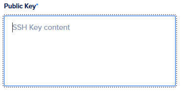
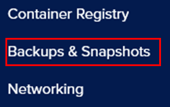
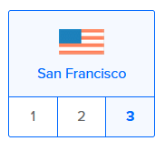
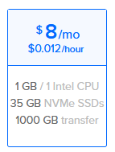
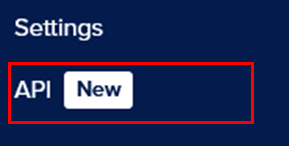
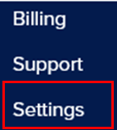

<!-- Start of the project -->
# Assignment 1

#### Today we will be going through the steps necessary to host a droplet (virtual private server) on your DigitalOcean account, securely access it using ssh keys, and use your droplet to create a second droplet with a partially automated configuration.

## Step 1: Create SSH Keys

- SSH keys are used to securely authenticate the identity of of a client when accessing a host. We will be creating two keys, one public key for the host, and one private key which will unlock access to the host.

1. Navigate to your home directory. 
- In windows this will generally be `C:\Users\username`, with username replaced by your windows username.

2. Check for the existence of a directory titled `.ssh`

3. If this directory does not exist please create it now.
- The .ssh directory will be used to store the SSH keys you create.

4. Open a terminal and run the following command:

- Note: Replace username with your windows username. Replace `email@gmail.com` with your email.
```
ssh-keygen -t ed25519 -f C:\Users\username\.ssh\one_key -C 
```
- Note: The -t flag defines the type of encryption the keys will use. In this case we'll be using the ed25519 standard.
- Note: The -f flag defines where on your computer we want to store the newly created keys. In this case the keys will use "one_key" as the name.
- Note: The -C flag allows us to create a comment for the keys. You can use this comment to help you differentiate between keys that you create, or add an identifier such as your email to mark it as one you created. In this case the keys will simply use the email address you enter.
 - `(SSH Academy, 2024)`

* You should now have two new files in your .ssh directory. The file called one_key is your private key, do not share this with anyone. The file called one_key.pub is your public key, and in the next step we will add it to your DigitalOcean account. 


## Step 2: Add Public SSH Key to DigitalOcean Account

1. Navigate to your .ssh directory and open one_key.pub with Visual Studio Code.

2. Copy the text string inside one_key.pub.


3. Navigate to the DigitalOcean website and log in to your account.


4. Click **Settings** on the left of the browser window.


5. Click the **Security** beneath the Settings heading.


6. Click **Add SSH Key**.


7. Paste the text string you copied from one_key.pub into the **Public Key field**.


8. Type in a name for your key in the **Key Name field**.
- Note: The key name can be used to help differentiate between keys that you add to your DigitalOcean account. 


## Step 3: Download Arch Linux Image

1. Navigate to https://gitlab.archlinux.org/archlinux/arch-boxes/-/packages/ .

2. Click **images** in the most recently uploaded row.


3. Click the **image name** that contains "cloudimg" and ends in ".qcow2".


- Note: The number on your version may be different than appears here. The download should start automatically and is roughly 500MB in size.


## Step 4: Upload Arch Linux Image to DigitalOcean

1. Navigate to the DigitalOcean website and log in to your account.

2. Click **Backups & Snapshots** on the menu on the left side of the screen.



3. Click **Custom Images**.


4. Click **Upload Image**.


5. Browse your computer to find the image you downloaded and press Open.


6. Click **Choose a Distribution**.
7. Click **Arch Linux**.


8. Click the **Datacenter Region** closest geographically to your location.
- Note: This is the server your image will be uploaded to, using the datacenter closest to your location will provide the lowest latency when accessing it. San Francisco shown here for demonstration purposes.


9. Click **Upload Image**.
- Note: There will be a charge of $.06 per GB per month to store this image.


## Step 5: Create Droplent Running Arch Linux

1. Navigate to the DigitalOcean website and log in to your account.

2. Click **Create** near the top of the page.


3. Click **Droplets**.


4. Click the **Region** geographically closest to your location.


5. Click **Custom Images** below the Choose an image heading.

6. Click the **image** you uploaded in step 4.


7. Click **Premium Intel** or **Premium AMD** under the CPU options heading.


8. Click the **$8/mo option**.



9. Click **SSH Key** under the Choose Authentication Method heading.


10. Click the **SSH key** that you added to your DigitalOcean Account.
- Note: Your key names will be different from this sample image.


11. Delete the text in the **Hostname field** and replace it with a short **nickname**.


12. Click **Create Droplet**.


## Step 6: Create DigitalOcean API Key

1. Navigate to the DigitalOcean website and log in to your account. 
2. Click **API**on the left menu near the bottom.



3. Click **Generate New Token**.


4. Type a name for the token into the **Token Name field**.


5. Click **Full Access**. This will give your API key read and write permissions so that you can create and edit droplets through the command line.


6. Click **Generate Token**.
- The page will redirect you to the API section and a personal access token will appear.


7. Click the **copy icon** to copy the personal access token, then save it in a safe place.
 


## Step 7: Connect To Your Droplet Through SSH

1. Open a terminal window on your computer.
2. Copy and paste the following code into the terminal, but don't run it yet.
```
ssh -i .ssh/one_key arch@
```
2. Navigate to the DigitalOcean website and log in to your account.

2. Click the **name of the project** you saved your droplet in at the top of the left menu.
- Note: If this is your first DigitalOcean project, the project is likely called "first-project".


3. Click **Copy** next to the IP address of your droplet to copy it.


4. Return to the terminal window you opened and paste the ** after the @ from your entry.


5. Press **enter** to run the command.
- Note: The -i flag is used to set the path to the private SSH key you created earlier.
- Note: The "arch" is a user that exists on the Arch Linux image.

- Your terminal prompt will change to arch@ followed by the droplet name if you connect successfully.

## Step 8: Install Software & Connect To DigitalOcean API

1. Update your droplet by running the following command:
```
sudo pacman -Syu
```
- Note: sudo gives you permission to modify the system
- Note: pacman is the package manager for installing, updating, or removing programs.
- Note: The flag -Syu finds the latest updates for installed packages and applies them.
- (Arch Linux, 2024)

- Note: This may take several minutes to complete.

2. Install neovim and doctl on your droplet by running the following command:
```
sudo pacman -S neovim doctl
```
- Note: Doctl is the command line interface for accessing DigitalOcean that you'll use for further droplet creation.
- Note: Neovim is a text editor you'll use to create a config file for automating aspects of droplet creation through the command line.
- Note: This may take several minutes to complete.

3. Run the following command to allow doctl to access your DigitalOcean account.
```
doctl auth init --context dev
```
- Note: The "dev" above is the label for your DigitalOcean account on doctl, you may change it to anything you like. 

4. Enter the DigitalOcean API key that you created on step 6 when you are prompted for it.

5. Run the following command to switch to the doctl account you just added.
```
doctl auth switch --context dev
```
- Note: If you changed the label for this account from dev on Instruction #3, replace it in the above code as well.

6. Run the following command to confirm your setup was successful.
```
doctl account get
```

- If it was successful you should see:


## Step 9: Create Config File On Droplet

1. Enter the following command to create a droplet configuration file.
```
nvim droplets.sh
```

2. Type **i** to enter insert mode.

3. Copy the following code and paste it into your configuration file.
```
users:
  - name: replacethis
    groups: wheel
    shell: /bin/bash
    sudo: ['ALL=(ALL) NOPASSWD:ALL']
    ssh-authorized-keys:
      - replacethis

packages:
  - neovim
  - doctl

disable_root: true
```
- (McNinch, 2024)

4. Delete the **"replacethis"** after name: and then type a username you'll use to access the droplet.

5. Delete the **"replacethis"** after the dash below ssh-authorized-keys: and then copy and paste the text contained in your public SSH key one_key.pub that you created on Step 1.

6. Hit the **escape key**.

7. Type **":wq"** and press **enter**. This will write and save the file then quit nvim.

## Step 10: Create New Droplet 

1. Run the following command to locate the image you uploaded earlier.
```
doctl compute image list | grep Arch
```
- Note: This searches DigitalOcean for images that contain the word Arch. Your image should be the only one returned in the search results, but if not you can compare the name of the image to the one you downloaded to select the correct one.

2. Write down the **number to the left of the image result**. This references the specific image we want to use for our droplet.


3. Copy and paste the following command:
```
doctl compute droplet create archy --region sfo3 --size s-1vcpu-1gb-35gb-intel --image replacethis --user-data-file droplets.sh --ssh-keys replacethis --wait
```
- Note: you can find more information on the doctl command line interface at https://docs.digitalocean.com/reference/doctl/
- Note: archy is the name of the droplet you'll be creating
- Note: the --region flag is used to set the region for your droplet, sfo3 refers to san francisco 3 here
- Note: the --size flag refers to the size of droplet we'll be creating
- Note: the --image flag is used to specify the image we want to create the droplet from
- Note: the --user-data-file flag is used to specify a file which can automate configuration of the droplet
- Note: the --ssh-keys flag is used to specify the ssh keys we want to use with this droplet
- Note: the --wait flag is used to pause the command line until the command finishes and the droplet is created
- (DigitalOcean, 2024)

4. Delete the **"replacethis"** after image and replace it with the **number you wrote down on Instruction #2**.

5. Navigate to DigitalOcean and log in.

6. Click **Settings** near the bottom of the left menu.



7. Click **Security**.


8. Click the **copy icon** to copy the Fingerprint of the key you created earlier.


9. Back on the terminal window, delete the **"replacethis"** after ssh-keys and replace it with with the **key fingerprint** you have copied.

10. Enter the command. After a few moments you should receieve a message that looks something like this:

- You will have another droplet up and running in your DigitalOcean project similar to this:


## Congratulations! You've accomplished everything!

## You're a Linux Champ!


# Resources and Citations
Arch Linux. (2024). pacman.<br>
https://wiki.archlinux.org/title/Pacman#:~:text=If%20you%20cannot%20enter%20the%20arch-chroot%20or

SSH Academy. (N.D). How to Use ssh-keygen to Generate a New SSH Key?<br>
https://www.ssh.com/academy/ssh/keygen#:~:text=Ssh-keygen%20is%20a%20tool%20for%20creating%20new

DigitalOcean. (2024). How to Install and Configure doctl.<br>
https://docs.digitalocean.com/reference/doctl/how-to/install/

DigitalOcean. (2024). Command Line Interface (CLI) Reference for doctl.<br>
https://docs.digitalocean.com/reference/doctl/reference/

DigitalOcean. (2024). How to Create A Personal Access Token.<br>
https://docs.digitalocean.com/reference/api/create-personal-access-token/

DigitalOcean. (2014). How To Use Cloud-Config For Your Initial Server Setup.<br>
https://www.digitalocean.com/community/tutorials/how-to-use-cloud-config-for-your-initial-server-setup

Nathan McNinch. (2024). Class Notes.<br>
Weeks 1, 2, 3, 4
